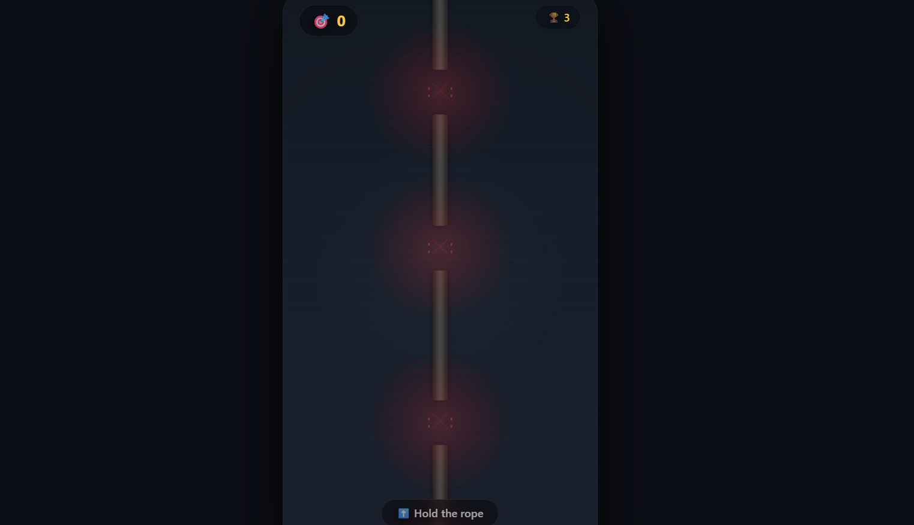

# 🧵 Rope Reflex

A simple but addictive reflex game where you press and hold a vertical rope, and quickly lift your finger to avoid "cuts" that scroll up the rope.  
Test your reaction speed and see how high you can score!

 <!-- Add a screenshot later -->

## 🎮 How to Play

- **Hold the rope** – keep your finger (or mouse) pressed on the black vertical line.
- **Cuts** appear as red gaps that move upward along the rope.
- When a cut reaches your finger, **lift your finger completely off the screen** to let the cut pass.
- If you are still touching the rope when a cut passes, the game ends.
- Each successful pass increases your **score**.
- The rope speeds up and cuts spawn faster as your score grows.

## ✨ Features

- 🎯 **One‑touch gameplay** – intuitive and mobile‑friendly.
- ⚡ **Progressive difficulty** – speed and spawn rate increase with your score.
- 🏆 **Local high‑score** – your best score is saved in your browser.
- 🎨 **Polished visuals** – dynamic lighting, particle‑like glow effects, and clear visual feedback.
- 📱 **Responsive** – works on any screen size, from phones to desktops.
- 🔔 **Real‑time status** – the bottom bar warns you when a cut is approaching.

## 🚀 How to Run

1. Clone or download this repository.
2. Open the `index.html` file in any modern web browser.
3. No server, no dependencies – it just works!

## 🛠️ Technologies

- HTML5
- CSS3 (with animations and glass‑morphism)
- Vanilla JavaScript (Canvas API for rendering)

## 📝 License

This project is open‑source and available under the [MIT License](LICENSE).

## 🤝 Contributions

Feel free to fork, improve, or suggest changes – this is a fun little experiment!

---

**Enjoy the challenge!**  
– *Built with ❤️ and a bit of adrenaline.*
